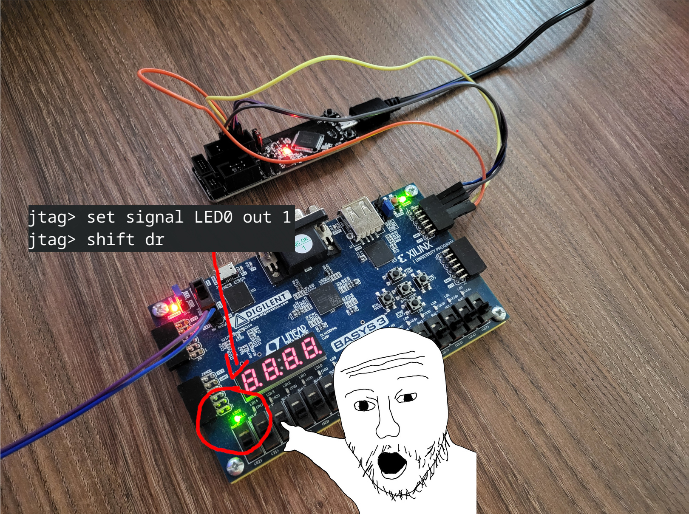

# JTAG IO Example
This is a fork of Igor Mohor's JTAG implementation from OpenCores.

This fork adds an example usage synthesizable on Basys 3 development board. There are 16 output cells connected to the board's LEDs which can be controlled.



## Generating the bitstream
**This step can be skipped by using pre-generated bitstream in Releases!**

Prerequisities:
- Vivado `bin` directory in PATH.
- fusesoc in PATH.

To generate a bitstream for Basys 3, just run:
```sh
fusesoc run jtag
```

Resulting bitstream will be available here: `build/freecores_ip_jtag_1.0.0/example_io_control-vivado/freecores_ip_jtag_1.0.0.bit`.

## Loading the bitstream
Bitstream may be loaded to the FPGA either via Vivado GUI, or via openFPGALoader. To open the Vivado project generated in the previous step:
```sh
vivado build/freecores_ip_jtag_1.0.0/example_io_control-vivado/freecores_ip_jtag_1.0.0.xpr
```
The bitstream may be loaded in the Hardware Manager in the GUI.

Alternatively, openFPGALoader can be used, but you need to have openFPGALoader installed:
```sh
openFPGALoader -b basys3 <path_to_bitstream>
```

## Using the example
JTAG IO is connected to the top right PMOD port:
```
TMS -> A15
TCK -> C15
TDI -> A17
TDO -> C16
```
1. Connect any JTAG adapter compatible with UrJTAG to the aforementioned IO.
2. Open UrJTAG and connect to the adapter using `cable` command.
    - for FTDI2232 adapter (e.g. ESP Prog): `cable ft2232 vid=0x0403 pid=0x6010 interface=0`
3. Run `detect`.
    - Unknown manufacturer warning will be reported. This is expected.
    - Verify the defice ID is: `0x149511C3`.
3. Load project's configuration: `include examples/example.urjtag`
    - The configuration is UrJTAG's alternative to JTAG's BSDL files.
    - It describes which cells correspond to which signals and where there are placed in the scan chain.
4. Set the TAP to an EXTEST mode:
    - `instruction EXTEST`
    - `shift ir`
5. Toggle some LEDs and apply changes by shifting EXTEST data register:
    - `set signal LED0 out 1`
        - Each of the 16 LEDs can be chosen: `LED0`, ... , `LED15`.
        - `0` to turn off, `1` to turn on.
    - `shift dr`
6. Your chosen LEDs should light up!

## Notes and precautions
For users of FTDI2232 based JTAG converters: in the case of FTDI2232, there may be some conflicts between Basys 3's builtin FTDI and your adapter's one. Please use external power supply with Basys 3 and disconnect the Basys 3 from your computer before proceeding.

## License
All Mohor's original source (`cells/`, `tap/`) directories are licensed under the GNU GPL v2. Additional works are licensed under the GNU GPL v3.